<h1>Count Modula</h1>
<h2>Plugin modules for VCV Rack v1.0 by Adam Verspaget (Count Modula)</h2>

Whilst these modules are offered free of charge, if you like them or are using them to make money, please consider a small donation to The Count for the effort.

&nbsp;

<h3>Analogue Shift Register</h3>
<table>
	<tr valign="top">
		<td width=150>
			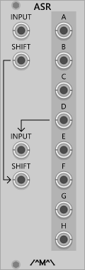
		</td> 
		<td>
			A dual 4 output or single 8 output shift register. On each the rising edge at the shift input, the signal present at each output is propagated to the next successive output and the input is simultaneously sampled and sent to the first output. The shift input on channel 2 is normalled to the shift input on channel 1 and the signal input on channel 2 is normalled to output 4 of channel 1 so that, with no cables connected to channel 2, the module functions as a single 8 output shift register.
		</td>
	</tr>
</table>

<h3>Attenuator</h3>
<table>
	<tr valign="top">
		<td width=100>
			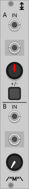
		</td> 
		<td>
			A basic dual attenuator with switchable attenuverting capability on the top channel. With no CV input the module will output control voltage between 0 and 10V (top channel -10V and +10V when in attenueverter mode) proportional to the position of the level knob.
			

				This module can process polyphonic signals. All channels are attenuated or attenuverted by the same amount.
			

		</td>
	</tr>
</table>

<h3>Basic 8 Step Sequencer</h3>
<table>
	<tr valign="top">
		<td width=220>
			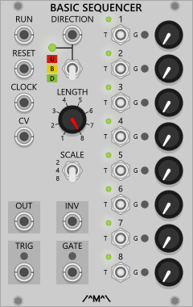
		</td> 
		<td>
			A single 8 step trigger/gate sequencer with voltage control over sequence length and direction. 
			The Reset input restarts the sequence at step one on the next clock cycle. 
			The Run input allows the sequencer to be started and stopped by the application of a gate signal with a low gate inhibiting the sequencer and a high gate enabling it. This functions like a pause button and operation resumes at the next clock cycle. 
			

				With a cable plugged into CV input, the Length switch is disabled and control of the sequence length is determined only by the applied voltage. Full sequence length is achieved with a 10V input. 
				The current sequence length is indicated by the small green lights situated next to the step numbers. 
			

			

				The sequencer has a selectable output range of 8 , 5 or 2 volts via the Scale switch.

			

			

				Three direction options are available via the direction switch or control voltage applied to the Direction input.
				<ul>
					<li>Forward: The sequence travels from left to right and restart on the left hand side. When in this mode the direction indicator will be green.
					<li>Pendulum: The sequence travels from left to right then back again before starting over. When in this mode the direction indicator will be yellow.
					<li>Reverse: The sequence travels from right to left then start again on the right hand side. When in this mode the direction indicator will be red.
				</ul>
				With a cable plugged into the direction CV input, the direction switch is disabled and control of the direction is determined only by the applied voltage which responds as follows:
				<ul>
					<li> Under 2 Volts: Forward
					<li> 2 Volts to 4 Volts: Pendulum
					<li> Over 4 Volts: Reverse
				</ul>
			

			

				There is 1 gate and 1 trigger output which can be selected via the individual step switches.
				The trigger outputs follow the pulse width of the clock signal and the gate outputs stay high for the duration of any selected step. Selecting the gate output for two consecutive steps results in a single gate signal for the duration of both steps. Note that the CV outputs will still change for each step even though the gate does not. 
			

			

				Extra channels can be added via the <a href="#SequencerExpanders">Sequencer Expander</a> modules.
			

		</td>
	</tr>
</table>

<h3>Binary Sequencer</h3>
<table>
	<tr valign="top">
		<td width=220>
			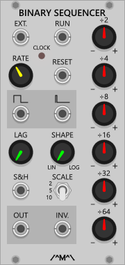
		</td> 
		<td>
			Similar to a now discontinued Frac format module, this is a binary counter based sequencer where the individual bits of the counter are mixed together in varying  proportions to produce a repeating CV pattern. The output can be smoothed into slowly varying voltages with the Lag and Lag Shape controls and the output range can be set to 2, 5 or 10 volts. The selected output range indicates the maximum voltage that can be produced when all of the knobs are fully clockwise. i.e the selected value is divided equally across the bit knobs. The sequencer can be internally or externally clocked and offers both gate and trigger outputs.<br.>
			

				Prior to v0.6.2, the Run/Reset input functions like a gate with a low gate value stopping the count and holding the outputs at 0V. A high gate value enables the sequencer with the count being reset on the positive edge of the gate. 
				From v0.6.2, the reset and run functions have been split into separate jack with the run functioning as outlined above however with a cable plugged into the rest input, it will not reset the sequencer on the positive edge of the gate.
			

			

			* new in v1.0: A new S&amp;H input has been added that, when a cable is connected, causes the Scale functionality to be bypassed and uses a sampled voltage (taken at the leading clock edge) as the base for the division knobs. Note that each knob will equate to 1/6th of the input voltage when at full scale.
			

		</td>
	</tr>
</table>

<h3>Boolean Logic Modules</h3>
<table>
	<tr valign="top">
		<td width=260>
			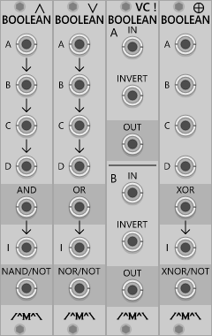
		</td> 
		<td>
			<ul>
				<li>AND: A quad input AND/NAND gate with built in NOT gate (logical inverter). The AND output is high if all connected inputs are also high. With nothing connected to the Inverter input (I), the NOT output will perform the NAND function.
				<li>OR: A quad input OR/NOR gate with built in NOT gate (logical inverter). The OR output is high if any connected input is high. With nothing connected to the Inverter input (I), the NOT output will perform the NOR function.
				<li>VC Inverter: a logical inverter with voltage control over the invert function. Will only invert if the enable input is High. 
				<li>XOR: A quad input XOR/XNOR gate with built in NOT gate (logical inverter). The XOR output is high if only one connected input is high. With nothing connected to the Inverter input (I), the NOT output will perform the XNOR function.
			</ul>
		</td>
	</tr>
</table>

<h3>Comparator</h3>
<table>
	<tr valign="top">
		<td width=140>
			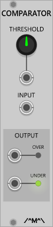
		</td> 
		<td>
			Compares the input signal with either an internal or external threshold value and outputs gate signals indicating if it is under or over that threshold.
		</td>
	</tr>
</table>

<h3>Event Arranger</h3>
<table>
	<tr valign="top">
		<td width=280>
			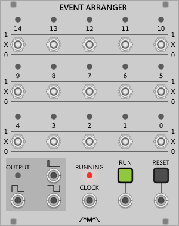
		</td> 
		<td>
			This is a VCV Rack implementation of the VC Clock and Event Arranger published in an article by John Blacet in the Jan/Feb edition of Synapse magazine. Without the VC clock but with an added twist. 
			Each switch corresponds to a bit in a binary counter and can be "mixed" into the output depending on the switch position. In position 1, the bit will be logically ANDed with any other "active" bit when it is high. In position 0, the bit will be inverted and logically ANDed with any other "active" bit i.e when it is low. In the centre or "X" position, the bit is considered to be "inactive" and is ignored. Depending on how the switches are set, this module can be used as a simple clock divider or a complex gate pattern generator.
		</td>
	</tr>
</table>

<h3>Gate Delay</h3>
<table>
	<tr valign="top">
		<td width=240>
			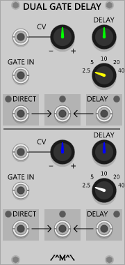
		</td> 
		<td>
			A dual gate delay line giving up to 40 seconds of delay with voltage control over the delay time. Note that switching from a shorter delay time range to a longer one may introduce time travel artifacts were a gate that has already been output may be output again at the end of the new longer delay time depending on where it is in the pipeline. This is due to the way the delay line functions and is normal behaviour. Three gate outputs are available with the Direct output following the gate input, the Delay output providing only the delayed gates middle output providing a logical mix of the two.
		</td>
	</tr>
</table>

<h3>Gate Modifier</h3>
<table>
	<tr valign="top">
		<td width=180>
			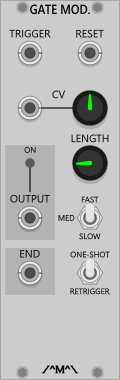
		</td> 
		<td>
			A voltage controlled gate length modifier with the following selectable ranges:
			<ul>
				Short: up to approx. 1 second
				Medium: up to approx. 10 seconds
				Long: up to 1 approx. 20 seconds		
			</ul>
			The CV input allows modulation of the gate length by approximately 1, 10 or 20 seconds depending on the selected range.
			

				The Retrigger/On-shot switch selects how the gate length modification is applied.
				<ul>
					<li>Retrigger: sets Output high for the duration of input gate <i>plus</i> the selected length.
					<li>One-shot: sets Output high only for the the selected length regardless of the input gate length.
				</ul>
				To shorten a gate signal, select One-shot and a length that is shorter than the input gate signal. 
			

			

				A trigger pulse is sent to the End output at the end of the extended or shortened gate cycle. 
			

		</td>
	</tr>
</table>

<h3>G2T</h3>
<table>
	<tr valign="top">
		<td width=100>
			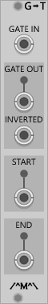
		</td> 
		<td>
			A gate converter module. Converts any signal into a gate. The gate output will be at 0V unless the voltage presented at the input is greater than 2.0V in which case the Gate output will be high (10V). The Inv Gate output functions the other way around, 10V unless the input voltage is over 2.0V in which case the output will be 0V. The Start trigger output will fire a 10ms pulse at the start or leading edge (i.e. on the transition from low to high) of the generated gate and the End trigger output will fire a 10ms pulse at the end or trailing edge (i.e. on the transition from high to low) of the generated gate.
		</td>
	</tr>
</table>

<h3>Inverter</h3>
<table>
	<tr valign="top">
		<td width=100>
			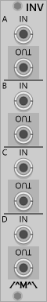
		</td> 
		<td>
			A quad voltage inverter. Unlike the Boolean Logic Inverter, this module inverts around zero. Positive voltage in become a negative voltage out and vice-versa.
			

				This module can process polyphonic signals.
			

		</td>
	</tr>
</table>

<h3>Mangler</h3>
<table>
	<tr valign="top">
		<td width=180>
			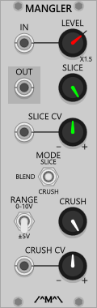
		</td> 
		<td>
			A voltage controlled sample rate and bit depth reducer or &quot;bit crusher&quot; designed to make a lo-fi mess of your audio or CV signals.
			

				Three operational modes allow for different lo-fi effects to be achieved:
				<ul>
					<li>Slice: Slices the input signal at the selected sample rate.
					<li>Crush: Crushes the bit depth down to the selected the number of steps.
					<li>Blend: Combines the Slice and Crush modes for maxmim mangling effect.
				</ul>
			

			

				Note, it is possible to have no output with low Crush settings and low level input signals. The input level control will amplify the input signal past about 2:00 up to a maximum of 150%.  
			

			

				The Range switch determines how control and audio voltages are handled
				<ul>
					<li>0-10V: For processing unipolar control signals in the range of 0-10V signals like envelopes or unipolar LFOs.
					<li>+/-5V: For processing bipolar signals within the -5V to +5V range such as VCOs. 
				</ul>
				Signals outside the selected range will be clamped to that range so oscillators processed via the 1-10V setting for example, will be half wave rectified and control signals processed using the +/-5V setting will be truncated at +5V.	
			

			

				This module can process polyphonic signals with each channel being mangled at the same sample rate and bit depth.
			

		</td>
	</tr>
</table>

<h3>Manual CV</h3>
<table>
	<tr valign="top">
		<td width=100>
			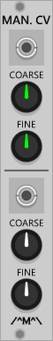
		</td> 
		<td>
			A simple dual manual CV generator offering +/- 10V with both coarse and fine controls.
		</td>
	</tr>
</table>

<h3>Manual Gate</h3>
<table>
	<tr valign="top">
		<td width=180>
			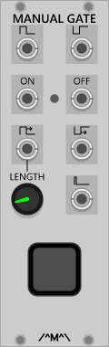
		</td> 
		<td>
			A manually triggered gate generator offering a number of simultaneous gate and inverted gate outputs.
			<ul>
				<li>Gate/Inv Gate: Outputs a high (or low in the case of the inverted output) gate level as long as the button is held down.
				<li>On/Off: Latched outputs that alternate between high and low with each press of the button.
				<li>Extended Gate: Functions like the GAte poutput but with a variable gate length
				<li>Trigger: Outputs a trigger signal of 10ms duration each time the button is pressed.
			</ul>
		</td>
	</tr>
</table>
 

<h3>Matrix Mixer</h3>
<table>
	<tr valign="top">
		<td width=280>
			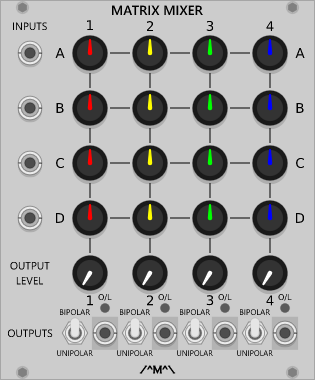
		</td> 
		<td>
			A 4 x 4 matrix mixer allowing up to 4 input signals to be independently mixed to 4 different outputs . Inputs down the left hand side can be mixed to the outputs at the bottom via the columns of knobs. A main level control is provided for each output along with an overload indicator. The knobs on each output channel can be set to attenuate or attenuvert using the associated Unipolar/Bipolar switch next to the output jack. The first input channel (top row) acts as a CV source if no cable is plugged into the jack.
		</td>
	</tr>
</table>

<a id="MinimusMaximus">
<h3>Minimus Maximus</h3>
<table>
<tr valign="top">
<td width=220>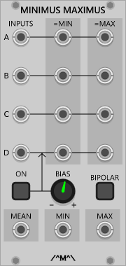</td> 
<td>
A signal processor that determines and outputs the minimum, maximum and mean (average) of up to 4 input signals along with gate signals (switchable between unipolar and bipolar values) for each input channel indicating that the associated input is equal to either the minimum or maximum value. The Bias controls allow the 4th channel to be set manually. When engaged, the 4th Channel input is ignored and the value of the Bias knob is used instead.</td>
</tr>
</table>

<h3>Mixer</h3>
<table>
	<tr valign="top">
		<td width=280>
			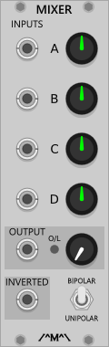
		</td> 
		<td>
			A basic 4 input utility mixer with output level control, overload indicator, inverted output and selectable bipolar/unipolar operation. The first input channel acts as a CV source if no cable is plugged into the jack.
		</td>
	</tr>
</table>

<h3>Morph Shaper</h3>
<table>
	<tr valign="top">
	<td width=160>
		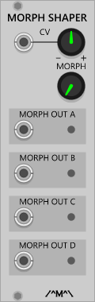
	</td> 
	<td>
		With kind permission from Dieter Doepfer, this is a VCV Rack version of the A-144 Morphing Controller. This module takes a ramped (typically) CV input signal and produces a set of 4 overlapping triangles depending on the position of the signal. These overlapping triangle signals can be used to control the levels of a VC mixer allowing it to morph between up to 4 different signals. The module is sensitive to input signal levels so the input level attenuverter control is capable of applying some amplification (up to 2 x positive or negative) to achieve the full morphing range on smaller signals. The manual control when used in conjunction with the CV input, acts as an offset to the CV input i.e the CV input value is added (or subtracted from depending on the attenuverter setting and CV input polarity) to the manual value before being processed. Note that the input is not limited to ramp signals and by inputting other signal types, interesting wave shaping effects can be achieved.
	</td>
	</tr>
</table>

<h3>Multiplexer</h3>
<table>
	<tr valign="top">
		<td width=300>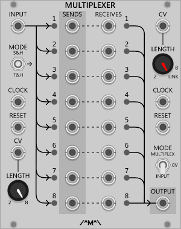</td> 
		<td>
			The multiplexer operates in two independent but interconnected parts:
			<ul>
				<li>A 1 input to 8 output router (sends)
				<li>An 8 input (receives) to 1 output selector 
			</ul>
			The number of steps in each half is user selectable and voltage controllable with the selector section able to be linked to use the length of the router section.
			

				The Clock input advances the router/selector to the next step on with each pulse received. The router Clock input is normalled to the selector Clock input. 
				The Reset input sets all outputs to 0V and sets the router/selector such that the first step will occur on the next clock pulse after the reset input goes low. The selector Reset input is normalled to the send router input. Operation is inhibited whilst the reset input is high.
			

			The router side has three operational modes:
			<ul>
				<li>S&amp;H: Sample &amp; Hold - the input is sampled on the rising edge of the clock and sent to the current output which is held at that value until the next time is selected.
				<li>&rarr;: Through - the input is directly sent to the selected output for the duration of the step then the output returns to 0V.
				<li>T&amp;H: Track &amp; Hold - operates the same way as the through mode but the output is held at the value of the input at the end of the step.
			</ul>
			The selector has four modes of operation which control the normalling behaviour of any unconnected inputs:
			<ul>
				<li>IN: Router Input - The output will follow the raw input (i.e the router mode is ignored) of the router section for the duration of the step.
				<li>0V: 0V Mode - 0V will be output for the duration of the step
				<li>A: Assocated Output - The value of the associated router step output is used (i.e. if the selector is at step 7 then the value of router output 7 is used regardless of the length and current step of the router)
				<li>M: Multiplex - The value of the currently selected router output is used , taking the router mode into consideration.
			</ul>
		</td>
	</tr>
</table>

<h3>Mute</h3>
<table>
	<tr valign="top">
		<td width=180>
			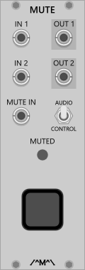
		</td> 
		<td>
			A performance mute controller with two independent inputs and outputs, voltage control over the mute function and switchable response (hard/soft) for instant processing of control signals or fast but pop free muting of audio signals. 
			With no cable plugged into the Mute In, The Mute button mutes and un-mutes the outputs with each press. Plugging a cable into the Mute IN disables the button and the muting is controlled by the presence of a high gate signal.  
			

				This module can process polyphonic signals. All channels are muted at the same time.
			

		</td>
	</tr>
</table>

<h3>Mute-iple</h3>
<table>
	<tr valign="top">
		<td width=180>
			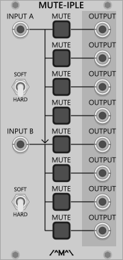
		</td> 
		<td>
			A dual 4-way/ Single 8 way mutable multiple. The top input is normalled to the bottom input creating a 1 to 8 mutable multiple. 
			

				New feature in v1.0.2: Soft/hard muting option. Use the soft muting option to avoid clicks when muting audio signals.
			

			

				This module can process polyphonic signals. All channels presented to the inputs are multed to the associated outputs and all channels on any given output are muted at the same time.
			

		</td>
	</tr>
</table>

<h3>Polyrhythmic Generator (Original Version)</h3>
	

		This version of the Polyrhythmic Generator has a bug in it which means it can not perform the odd divisions that it was intended to and is dividing by 2, 4, 6, 8 rather than 1, 2 ,3, 4, 5 etc. Unfortunately there was no way to rectify this without breaking existing patches so 
		this version has been retained for the time being however it is now deprecated and will no longer be supported. Users should convert any existing patches to use the new version ASAP as it is not likely to be ported across to the next incarnation of Rack. 
	

	

		<i>Existing patches can be converted to use the new version using the following method:</i>
	

	<ol>
		<li>If not already turned on, turn Parameter Tooltips on from the Rack Main Menu (View->Parameter Tooltips).
		<li>Add the MkII version module to your patch and duplicate the settings of all but the division controls.
		<li>Starting at the top channel and working down, hover the mouse over the division control and note the value.
		<li>Find the row in the table below where the value of the old control fits between the &quot;From&quot; and &quot;To&quot; values and set the equivalent control in the new module to the value in the right hand column.
		<li>Repeat for the other seven dividers (or however many you are using in your patch).
		<li>Drag the inputs/outputs from the old module to the same inputs/outputs on the new module.
		<li>Finally, set the module into &quot;Legacy Mode&quot; via the module menu and your patch should sound the same as it used to although you may need to tweak the CV controls slightly if the patch does not sound quite right.
	</ol>

<table>
	<tr><td colspan=2 align="center"><b>Old Module Values</b></td><td align="center"><b>Mk II Values</b></td></tr>
	<tr><td width="100" align="center"><b>From</b></td><td width="100" align="center"><b>To</b></td><td width="100" align="center"><b>Use</b></td></tr>
	<tr><td  align="center">0.000</td><td  align="center">0.666</td><td  align="center">1</td></tr>
	<tr><td  align="center">0.667</td><td  align="center">1.333</td><td  align="center">2</td></tr>
	<tr><td  align="center">1.334</td><td  align="center">1.999</td><td  align="center">3</td></tr>
	<tr><td  align="center">2.000</td><td  align="center">2.666</td><td  align="center">4</td></tr>
	<tr><td  align="center">2.667</td><td  align="center">3.333</td><td  align="center">5</td></tr>
	<tr><td  align="center">3.334</td><td  align="center">3.999</td><td  align="center">6</td></tr>
	<tr><td  align="center">4.000</td><td  align="center">4.666</td><td  align="center">7</td></tr>
	<tr><td  align="center">4.667</td><td  align="center">5.333</td><td  align="center">8</td></tr>
	<tr><td  align="center">5.334</td><td  align="center">5.999</td><td  align="center">9</td></tr>
	<tr><td  align="center">6.000</td><td  align="center">6.665</td><td  align="center">10</td></tr>
	<tr><td  align="center">6.666</td><td  align="center">7.331</td><td  align="center">11</td></tr>
	<tr><td  align="center">7.332</td><td  align="center">7.997</td><td  align="center">12</td></tr>
	<tr><td  align="center">7.998</td><td  align="center">8.663</td><td  align="center">13</td></tr>
	<tr><td  align="center">8.664</td><td  align="center">9.329</td><td  align="center">14</td></tr>
	<tr><td  align="center">9.330</td><td  align="center">9.995</td><td  align="center">15</td></tr>
	<tr><td  align="center">9.996</td><td  align="center">10.000</td><td  align="center">16</td></tr>
</table>

<h3>Polyrhythmic Generator MkII</h3>
<table>
	<tr valign="top">
		<td width=340>
			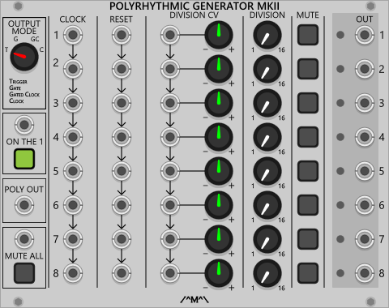
		</td> 
		<td>
			A set of 8 voltage controlled clock dividers that can be used to generate polyrhythms by clocking and/or dividing at different rates. The individual clock, reset and division CV  inputs of each channel are normalled to the previous channel allowing for global or segmented/individual control. Plugging a cable into the clock, reset or CV input a given channel will break the normalling input and inputs on subsequent channels from the input on the previous channel. Normalling is applied per input (breaking the CV input  does not break the clock normalling for example) so it is possible to have individual CV control over the divisions on each channel  whilst maintaining a common clock. Along with a global mute button which also has voltage control, each channel can be manually muted individually.
			

			The outputs can be set globally to one of 4 modes:
			<ul>
				<li>Trigger: A single 10ms trigger pulses for every Nth  clock pulse.
				<li>Gate: The gate outputs operate like a binary clock divider where the output is high for the selected number of clock pulses then low for the selected number of clock pulses etc.
				<li>Gated Clock: The input clock is sent to the output for the selected number of divisions then it is muted for the same number of divisions etc. 
				<li>Clock: A single clock pulse for every Nth clock pulse.
			</ul>
			The &quot;On The 1&quot; beat mode control and associated CV input set whether the generator outputs pulses on the fist count of the division or on the first positive going transition of the underlying divided clock). When set to &quot;ON The 1&quot;, the first count will send pulses to the output upon reset then every N clock pulses as opposed to only after N/2 clocks have been received then every N clock pulses. The former is considered to be more musical.
			

				This module can generate polyphonic triggers. These are available at the Poly Out jack.
			

			<b>Notes:</b>
			

				The MkII module differs from the original version in two ways:
				<ul>
					<li>It has switches for the division controls rather than the freely adjustable knobs to make it easier to dial in the desired division ratios. 
					<li>The correct division ratios including odd divisions are now used (1, 2, 3, 4, 5 etc rather than 1, 2, 4, 6 , 8, 10 etc)
				</ul>
				For those with old patches requiring the behaviour of the original version or who simply prefer the way it worked, the MkII module can be switched over to &quot;Legacy Mode&quot; via an option in the module context menu. Notes on converting old patches to use the MkII version of this module can be found <a href="#PolyrhythmicGenerator">here</a>.
			

		</td>
	</tr>
</table>

<h3>Rectifier</h3>
<table>
	<tr valign="top">
		<td width=180>
			
		</td> 
		<td>
			A precision rectifier offering full wave, and both positive and negative half wave rectification. The input signals are rectified around a use settable and voltage controllable axis.  A set of inverted outputs for each rectified signal is also available.
			

				This module can process polyphonic signals. All channels are rectified around the same axis.
			

		</td>
	</tr>
</table>

<h3>Sample & Hold</h3>
<table>
	<tr valign="top">
		<td width=180>
			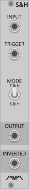
		</td> 
		<td>
			A basic sample and hold with optional track an hold ability. With the Mode switch in the T&H position, the output follows the input whilst the trigger input is high and holds the last sampled value on the transition of the trigger to a low state. 
			

				This module can process polyphonic signals. All channels are sampled and held with a single trigger.
			

		</td>
	</tr>
</table>

<h3>Sequencer Expanders</h3>
<table>
	<tr valign="top">
		<td width=340>
			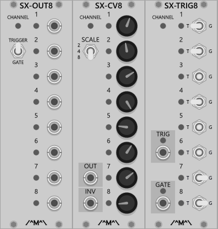
		</td> 
		<td>
			A set of expander modules that add extra channel functionality to the Count Modula 8 step sequencers.
			<ul>
				<li>SX-OUT8: Adds individual gate outputs for each step. The Trigger/Gate switch determines whether the outputs stay high for the duration of the step (gate) or follow the clock width (trigger)
				<li>SX-CV8: Adds another channel of CV output. This module functions like the CV strip of the Basic Sequencer with Scale switch determining the output scale as 2, 4 or 8 volts. 
				<li>SX-TRIG8: Adds another channel of Trigger/Gate output.This module functions like the gate/trigger switch strip on the Basic Sequencer with the switches selecting either of the trigger or gate output or no output at all when the step is active.
			</ul>
			

				These modules use the new expander functionality introduced in Rack V1 so must be placed immediately to the right of a sequencer module in order to function. Multiple expanders can be used by placing each extra expander immediately to the right of an already connected expander and they can be used in any combination and in any order. It should be noted a s sample delay is introduced with each expander.
			

			

				Each expander has a channel indicator light to show which channel of the parent or master sequencer they are associated with and the colour of the indicator will match that of the associated master sequencer channel knobs should that master have multiple channels.
				Note that the direction, number of steps and the current step of the associated master channel are passed through to the expanders. i.e. If the master channel is set to run in reverse then each expander attached to that channel will also run in reverse.
			

		</td>
	</tr>
</table>

<h3>Shepard Generator</h3>
<table>
	<tr valign="top">
		<td width=180>
			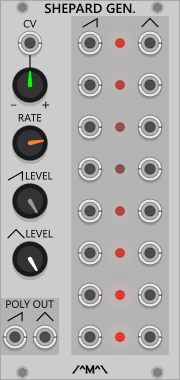
		</td> 
		<td>
			Generates a set of 8 ramp and sawtooth signals appropriately phased for generation of Shepard tones (tones that sound like they are continually rising or falling) when coupled with 8 VCOs and VCAs. Slower modulation rates work best for this effect.
			

				This module can function as a polyphonic controller. The saw and triangle waveforms are available on separate channels within their respective Poly Out jacks.
			

		<td>
	</tr>
</table>

<h3>SR Flip Flop</h3>
<table>
	<tr valign="top">
		<td width=180>
			
		</td> 
		<td>
			A dual Set/Reset flip flop with optional enable. A high gate signal at the S input whilst the flip flop is enabled sets the Q output high and the NOTQ output low. A high gate signal at the R resets the Q output to low and the NOTW output to high. Both inputs high at the same result in an invalid state causing both outputs to also be high. With nothing plugged into the enable input, the flip flop is permanently enabled however with a cable plugged in, a high signal must be present at the input in order to set or reset the flip flop.
		</td>
	</tr>
</table>

<h3>Step Sequencer - 8 Step</h3>
<table>
	<tr valign="top">
		<td >
			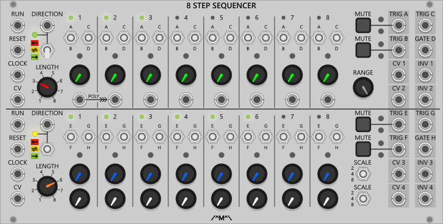
		</td>
	</tr>
	<tr>
		<td>
			A dual 8 step trigger/gate sequencer with voltage control over sequence lengths and direction along with individual inputs for each step on one channel. 
			The Reset input restarts the sequence at step one on the next clock cycle. 
			The Run input allows the sequencer to be started and stopped by the application of a gate signal with a low gate inhibiting the sequencer and a high gate enabling it. This functions like a pause button and operation resumes at the next clock cycle. 
			The Run, Clock and Reset inputs of channel 2 are normalled to channel 1. 
			

				With a cable plugged into CV input, the Length switch is disabled and control of the sequence length is determined only by the applied voltage. Full sequence length is achieved with a 10V input. The CV inputs are NOT normalled. 
				The current sequence length is indicated by the small green lights situated next to the step numbers. 
			

			

				Each sequencer can output up to 8 octaves of CV with channel 2 having selectable ranges of 8 , 5 and 2 volts on each row via the Range switches and the channel 1 having continuously variable range via the Scale attenuator knob.

				Additionally, channel 1 has individual inputs per step for processing of external signals. With no cables plugged in, the CV2 output follows the CV1 output for each step.
				When a cable is plugged in to a step input, the output when that step is selected will be the input voltage attenuated by the associated knob and channel scale setting. 
				Note that the knobs for channel 1 are common to the CV1 and CV2 outputs with CV1 reflecting the value of the knob scaled by the Scale control which is also common to both outputs. 
				The individual input for step 1 has a special feature for polyphonic cables whereby each channel present is spread across the remaining unconnected step inputs allowing the sequencer to step through each channel in turn like an arpeggiator. 
			

			

				Three direction options are available via the direction switch or control voltage applied to the Direction input.
				<ul>
					<li>Forward: The sequence travels from left to right and restart on the left hand side. When in this mode the direction indicator will be green.
					<li>Pendulum: The sequence travels from left to right then back again before starting over. When in this mode the direction indicator will be yellow.
					<li>Reverse: The sequence travels from right to left then start again on the right hand side. When in this mode the direction indicator will be red.
				</ul>
				

				With a cable plugged into the direction CV input, the direction switch is disabled and control of the direction is determined only by the applied voltage which responds as follows:
				<ul>
					<li> Under 2 Volts: Forward
					<li> 2 Volts to 4 Volts: Pendulum
					<li> Over 4 Volts: Reverse
				</ul>
				The direction inputs are not mormalled. 
				Change of direction from forward to reverse or vice-versa occurs on the next clock after the change is made. When changing to pendulum mode the current direction will be maintained until the end (or start) of the sequence is reached at which point the direction will change. 
			

				Note that if the seuqunce length is shortened whilst the sequencer is in the reverse dirtection and the current step is outside the selected length, the sequence will continue from it's current step rather than jumping to the new end step.
			

			

				Each channel has 1 gate output and 3 trigger outputs. 
				The gate outputs stay high for the duration of any selected step. Selecting the gate output for two consecutive steps results in a single gate signal for the duration of both steps. Note that the CV outputs will still change for each step even though the gate does not. 
				The trigger outputs follow the pulse width of the clock signal. 
			

			The mute buttons affect both adjacent trigger/gate outputs the same time.
		</td>
	</tr>
</table>

<h3>Sub Harmonic Generator</h3>
<table>
	<tr valign="top">
		<td width=220>
			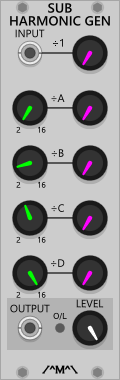
		</td> 
		<td>
			Accepts a signal from a VCO/LFO and generates a mix of user selectable sub harmonic square waves. This module works best when fed with a square wave but will function with any other waveshape.
			

			<b>Important Note:</b> This module is highly likely to introduce aliasing artefacts. An anti aliasing mode is planned for a future release.
			

		</td>	
	</tr>
</table>

<h3>Tapped Gate Delay</h3>
<table>
	<tr valign="top">
		<td width=220>
			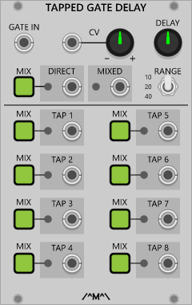
		</td> 
		<td>
			A gate delay that offers up to 40 seconds of delay with tapped outputs at equal intervals along the delay line. Can be cascaded for even longer delays. Note that switching from a shorter delay time range to a longer one may introduce time travel artifacts were a gate that has already been output may be output again depending on where it is in the delay line at the time of the change. This is due to the way the delay line functions and is normal behaviour. The Direct output follows the Gate input whilst the Mixed output provides a user selectable combination of the direct output and the tapped outputs via the Mix buttons. 
		</td>	
	</tr>
</table>

<h3>T Flip Flop (Toggle)</h3>
<table>
	<tr valign="top">
		<td width=180>
			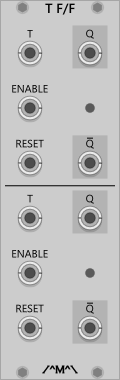
		</td> 
		<td>
			A dual Toggle (T type) flip flop with optional enable. A positive going gate signal at the T input whilst the flip flop is enabled alternates the Q output high and low and the NOTQ output between low and high. A high gate signal at the Reset input resets the Q output to low and the NOTW output to high. With nothing plugged into the enable input, the flip flop is permanently enabled however with a cable plugged in, a high signal must be present at the input in order to set or reset the flip flop.
		</td>
	</tr>
</table>

<h3>Trigger Sequencer - 8 Step</h3>
<table>
	<tr valign="top">
		<td width=340>
			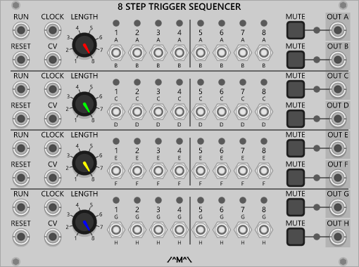
		</td> 
		<td>
			A set of four 8 Step trigger sequencers in a single panel each with voltage control over the sequence length and two independent outputs. 
			The Reset input restarts the sequence at step one on th next clock cycle. 
			The Run input allows the sequencer to be started and stopped by the application of a gate signal with a low gate inhibiting the sequencer and a high gate enabling it. This functions like a pause button and operation resumes at the next clock cycle. 
			The Run, Clock and Reset inputs of each channel are normalled to the previous channel. 
			With a cable plugged into CV input, the length switch is disabled and control of the sequence length is determined only by the applied voltage. Full sequence length is achieved with a 10V input. The CV inputs are NOT normalled.
			The current sequence length is indicated by the small green lights situated next to the step numbers. 
		</td>
	</tr>
</table>

<h3>Trigger Sequencer - 16 Step</h3>
<table>
	<tr valign="top">
		<td >
			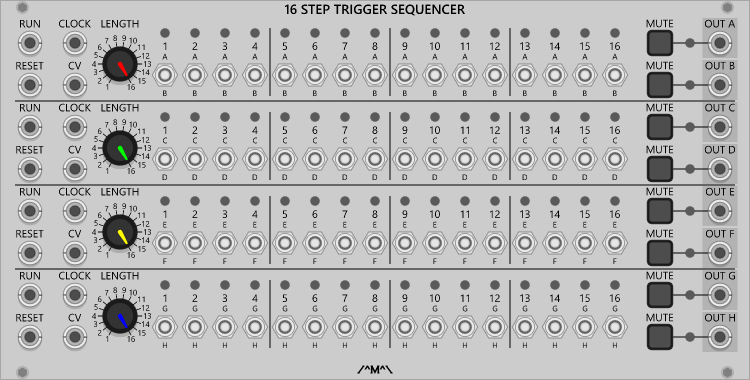
		</td>
	</tr>
	<tr>
		<td>
			A set of four 16 Step trigger sequencers in a single panel each with voltage control over the sequence length and two independent outputs. 
			The Reset input restarts the sequence at step one on th next clock cycle. 
			The Run input allows the sequencer to be started and stopped by the application of a gate signal with a low gate inhibiting the sequencer and a high gate enabling it. This functions like a pause button and operation resumes at the next clock cycle. 
			The Run, Clock and Reset inputs of each channel are normalled to the previous channel. 
			With a cable plugged into CV input, the length switch is disabled and control of the sequence length is determined only by the applied voltage. Full sequence length is achieved with a 10V input. The CV inputs are NOT normalled. 
			The current sequence length is indicated by the small green lights situated next to the step numbers. 
		</td>
	</tr>
</table>

<h3>Voltage Controlled Frequency Divider</h3>
	

		This version of the Voltage Controlled Frequency Divider has a bug in it which means it can not perform the odd divisions that it was intended to and is dividing by 2, 4, 6, 8 rather than 1, 2 ,3, 4, 5 etc. Unfortunately there was no way to rectify this without breaking existing patches so 
		this version has been retained for the time being however it is now deprecated and will no longer be supported. Users should convert any existing patches to use the new version ASAP as it is not likely to be ported across to the next incarnation of Rack. 
	

	

		<i>Existing patches can be converted to use the new version using the following method:</i>
	

	<ol>
		<li>If not already turned on, turn Parameter Tooltips on from the Rack Main Menu (View->Parameter Tooltips).
		<li>Add the MkII version module to your patch and duplicate the settings of the CV control.
		<li>Hover the mouse over the division control and note the value.
		<li>Find the row in the table below where the value of the old control fits between the &quot;From&quot; and &quot;To&quot; values and set the division control in the new module to the value in the right hand column.
		<li>Drag the inputs/outputs from the old module to the same inputs/outputs on the new module.
		<li>Finally, set the module into &quot;Legacy Mode&quot; via the module menu and your patch should sound the same as it used to although you may need to tweak the CV control slightly if the patch does not sound quite right.
	</ol>
	

<table>
	<tr><td colspan=2 align="center"><b>Old Module Values</b></td><td align="center"><b>Mk II Values</b></td></tr>
	<tr><td width="100" align="center"><b>From</b></td><td width="100" align="center"><b>To</b></td><td width="100" align="center"><b>Use</b></td></tr>
	<tr><td align="center">0.000</td><td align="center">0.500</td><td align="center">1</td></tr>
	<tr><td align="center">0.501</td><td align="center">0.999</td><td align="center">2</td></tr>
	<tr><td align="center">1.000</td><td align="center">1.499</td><td align="center">3</td></tr>
	<tr><td align="center">1.500</td><td align="center">1.999</td><td align="center">4</td></tr>
	<tr><td align="center">2.000</td><td align="center">2.499</td><td align="center">5</td></tr>
	<tr><td align="center">2.500</td><td align="center">2.999</td><td align="center">6</td></tr>
	<tr><td align="center">3.000</td><td align="center">3.499</td><td align="center">7</td></tr>
	<tr><td align="center">3.500</td><td align="center">3.999</td><td align="center">8</td></tr>
	<tr><td align="center">4.000</td><td align="center">4.499</td><td align="center">9</td></tr>
	<tr><td align="center">4.500</td><td align="center">4.999</td><td align="center">10</td></tr>
	<tr><td align="center">5.000</td><td align="center">5.499</td><td align="center">11</td></tr>
	<tr><td align="center">5.500</td><td align="center">5.999</td><td align="center">12</td></tr>
	<tr><td align="center">6.000</td><td align="center">6.499</td><td align="center">13</td></tr>
	<tr><td align="center">6.500</td><td align="center">6.999</td><td align="center">14</td></tr>
	<tr><td align="center">7.000</td><td align="center">7.499</td><td align="center">15</td></tr>
	<tr><td align="center">7.500</td><td align="center">7.999</td><td align="center">16</td></tr>
	<tr><td align="center">8.000</td><td align="center">8.499</td><td align="center">17</td></tr>
	<tr><td align="center">8.500</td><td align="center">8.999</td><td align="center">18</td></tr>
	<tr><td align="center">9.000</td><td align="center">9.499</td><td align="center">19</td></tr>
	<tr><td align="center">9.500</td><td align="center">9.999</td><td align="center">20</td></tr>
	<tr><td align="center">10.000</td><td align="center">10.000</td><td align="center">21</td></tr>
</table>
	

<h3>Voltage Controlled Frequency Divider MkII</h3>
<table>
	<tr valign="top">
		<td width=100>
			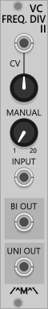
		</td> 
		<td>
			

				A frequency divider with a variable and voltage controlled division ratio from 1 to around 20. Can be used with VCOs to create suboctaves or clocks to divide down to lower rates.
			

			<b>Notes:</b>
			

				This module is highly likely to introduce aliasing artefacts when driven with audio frequencies. An anti aliasing mode is planned for a future release.
			

			

				The MkII module differs from the original version in two ways:
				<ul>
					<li>It has switches for the division controls rather than the freely adjustable knobs to make it easier to dial in the desired division ratios. 
					<li>The correct division ratios including odd divisions are now used (1, 2, 3, 4, 5 etc rather than 1, 2, 4, 6 , 8, 10 etc)
				</ul>
				For those with old patches requiring the behaviour of the original version or who simply prefer the way it worked, the MkII module can be switched over to &quot;Legacy Mode&quot; via an option in the module context menu. Notes on converting old patches to use the MkII version of this module can be found <a href="#VCFrequencyDivider">here</a>.
			

		</td>
	</tr>
</table>

<h3>Voltage Controlled Polarizer </h3>
<table>
	<tr valign="top">
		<td width=180>
			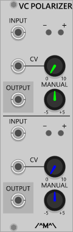
		</td> 
		<td>
			A dual voltage controlled polarizer. Inverts the the incoming signal under manual/voltage control. A negative control voltage at the CV input will invert the input signal and the amplitude of the CV signal will control the output amplitude. The manual amount is summed with CV amount before being applied.
			

				This module can process polyphonic signals. All channels are polarized by the same amount.
			

		</td>
	</tr>
</table>

<h3>Voltage Controlled Switch</h3>
<table>
	<tr valign="top">
		<td width=100>
			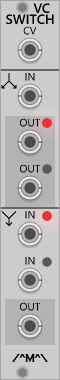
		</td> 
		<td>
			Selects between 2 inputs or routes 1 input to one two outputs based on the level of the signal at the CV input.
			

				This module can process polyphonic signals. All channels are switch by the same control voltage.
			

		</td>
	</tr>
</table>

<h2>CGS Based Modules</h2>
A nod to the genius of Ken stone, these are some of my favourite CGS designs realised in VCV Rack format. 
<a id="CVSpreader">
<h3>CV Spreader</h3>
<table>
	<tr valign="top">
		<td width=200>
			
		</td> 
		<td>
			This module accepts two CV inputs, &quot;Base&quot; and &quot;Spread&quot; and creates a set of new CV values that are spread either side of the base value by an amount determined by the spread value. The Odd/Even switch determines whether the spread occurs around the base value (odd spread) or not (even spread). With the spread value at 0, each output merely reflects the value at the base input however as the spread value increases or decreases, the spread outputs will increase or decrease by 1/5th  of the spread value. A 5 volt spread input with a 0 volt base input will produce outputs that are  1 volt apart ranging from -5 to +5 volts.
		</td>
	</tr>
</table>

<h3>Burst Generator</h3>
<table>
	<tr valign="top">
		<td width=200>
			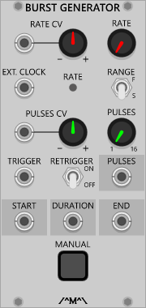
		</td> 
		<td>
			This module generates bursts of 1-16 pulses whenever a trigger is received at the trigger input. The pulses can be generated internally or via an external clock at the Ext. Clock input. Where the internal clock is used, the pulses are synchronised to start when the trigger is received however when using an external clock, the pulses will start at the next rising edge of the incoming clock. The number of pulses per burst  and internal burst rate and can both be independently controlled via CV with the Range switch determining whether the internal burst rate is slow or fast. The retrigger switch sets whether or not the burst generator must wait until the current burst of pulses is complete before it can be triggered again or if it can interrupt the current burst and start again immediately. Two outputs, Start and  End, each give a pulse at the start of the burst and end of the burst respectively whilst a third output, Duration, offers a gate signal that lasts for the duration of the burst.
		</td>
	</tr>
</table>

<!--

<h3>title</h3>
<table>
	<tr valign="top">
		<td width=100>
			
		</td> 
		<td>
			blurb
		</td>
	</tr>
</table>
--/>

