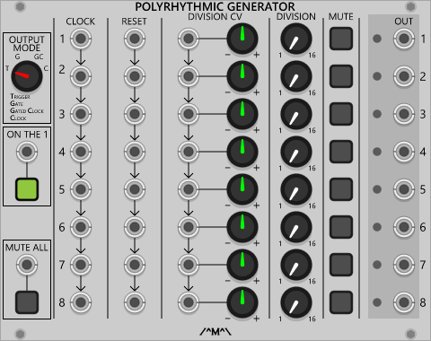
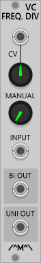

<h1>Count Modula</h1>
<h2>Plugin modules for VCV Rack by Adam Verspaget (Count Modula)</h2>

<h3>Analogue Shift Register</h3>
<table>
<tr valign="top">
<td width=150></td> 
<td>A dual 4 output or single 8 output shift register. On each the rising edge at the shidt input, the signal present at each output is propagated to the next successive output and the input is simultaneously sampled and sent to the first output. The shift input on channel 2 is normalled to the shift input on channel 1 and the signal input on channel 2 is normalled to output 4 of channel 1 so that, with no cables connected to channel 2, the module functions as a single 8 output shift register.</td>
</tr>
</table>

<h3>Attenuator</h3>
<table>
<tr valign="top">
<td width=100></td> 
<td>A basic dual attenuator with switchable attenuverting capability on the top channel. With no CV input the module will output control voltage between 0 and 10V (top channel -10V and +10V when in attenueverter mode) proportional to the position of the level knob.</td>
</tr>
</table>

<h3>Binary Sequencer</h3>
<table>
<tr valign="top">
<td width=220></td> 
<td>Similar to a now discontinued Frac format module, this is a binary counter based sequencer where the individual bits of the counter are mixed together in varying  proportions to produce a repeating CV pattern. The output can be smoothed into slowly varying voltages with the Lag and Lag Shape controls and the outpur range cab be set to 2, 5 or 10 volts. The sequencer can be internally or externally clocked and offers both gate and trigger outputs</td>
</tr>
</table>

<h3>Boolean Logic Modules</h3>
<table>
<tr valign="top">
<td width=260></td> 
<td>
<ul>
<li>AND: A quad input AND/NAND gate with built in NOT gate (logical inverter). The AND output is high if all connected inputs are also high. With nothing connected to the Inverter input (I), the NOT output will perform the NAND function.
<li>OR: A quad input OR/NOR gate with built in NOT gate (logical inverter). The OR output is high if any connected input is high. With nothing connected to the Inverter input (I), the NOT output will perform the NOR function.
<li>VC Inverter: a logical inverter with voltage control over the invert function. Will only invert if the enable input is High. 
<li>XOR: A quad input XOR/XNOR gate with built in NOT gate (logical inverter). The XOR output is high if only one connected input is high. With nothing connected to the Inverter input (I), the NOT output will perform the XNOR function.
</ul>
</td>
</tr>
</table>

<h3>Comparator</h3>
<table>
<tr valign="top">
<td width=140></td> 
<td>Compares the input signal with either an internal or external threshold value and outouts gate signals indicating if it is under or over that threshold.</td>
</tr>
</table>

<h3>Event Arranger</h3>
<table>
<tr valign="top">
<td width=280></td> 
<td>This is a VCV Rack implementation of the VC Clock and Event Arranger published in an article by John Blacet in the Jan/Feb edition of Synapse magazine. Without the VC clock but with an added twist. 
  
Each switch corresponds to a bit in a binary counter and can be "mixed" into the output depending on the switch position. In position 1, the bit will be logically ANDed with any other "active" bit when it is high. In position 0, the bit will be inverted and logically ANDed with any other "active" bit i.e when it is low. In the centre or "X" position, the bit is considered to be "inactive" and is ignored. Depending on how the switches are set, this module can be used as a simple clock divider or a complex gate pattern generator.</td>
</tr>
</table>

<h3>Gate Delay</h3>
<table>
<tr valign="top">
<td width=240></td> 
<td>A dual gate delay line giving up to 40 seconds of delay with voltage control over the delay time. Note that switching from a shorter delay time range to a longer one may introduce time travel artefacts were a gate that has already been output may be output again at the end of the new longer delay time depending on where it is in the pipeline. This is due to the way the delay line functions and is normal behaviour. Three gate outputs are available with the Direct output following the gate input, the Delay output providing only the delayed gates middle output providing a logical mix of the two.</td>
</tr>
</table>

<h3>G2T</h3>
<table>
<tr valign="top">
<td width=100></td> 
<td>A gate converter module. Converts any signal into a gate. The gate output will be at 0V unless the voltage presented at the input is greater than 0.1V in which case the Gate oputput will be high (10V). The Inv Gate output functions the other way around, 10V unless the input voltage is over 0,.1V in which case the output will be 0V. The Start trigger output will fire a 10ms pulse at the start or leading edge (i.e. on the transition from low to high) of the generated gate and the End trigger output will fire a 10ms pulse at the end or trailing edge (i.e. on the transition from high to low) of the genereated gate.</td>
</tr>
</table>

<h3>Inverter</h3>
<table>
<tr valign="top">
<td width=100></td> 
<td>A quad voltage inverter. Unlike the Boolean Logic Inverter, this module inverts around zero. Positive voltage in become a negative voltage out and vice-versa.</td>
</tr>
</table>

<h3>Manual CV</h3>
<table>
<tr valign="top">
<td width=100></td> 
<td>A simple dual manual CV generator offering +/- 10V with both coarse and fine controls.</td>
</tr>
</table>

<h3>Manual Gate</h3>
<table>
<tr valign="top">
<td width=180></td> 
<td>A manually triggered gate generator offering a number of simultaneous gate and inverted gate outputs.
<ul>
<li>Gate/Inv Gate: Outputs a high (or low in the case of the invrted output) gate level as long as the button is held down.
<li>On/Off: Latched outputs that alternate between high and low with each press of the button.
<li>Extended Gate: Functions like the GAte poutput but with a variable gate length
<li>Trigger: Outputs a trigger signal of 10ms duration each time the button is pressed.
</ul>
</td>
</tr>
</table>
 
<h3>Matrix Mixer</h3>
<table>
<tr valign="top">
<td width=280></td> 
<td>A 4 x 4 matrix allowing up to 4 input signals to be independently mixed to 4 different outputs . Inputs down the left hand side can be mixed to the outputs at the bottom via the columns of knobs. A main level control is provided for each output along with an overload indicator. The knobs on each output channel can be set to attenuate or attenuvert using the associated Unipolar/Bipolar switch next to the output jack. The first input channel (top row) acts as a CV source if no cable is plugged into the jack.</td>
</tr>
</table>

<h3>Minimus Maximus</h3>
<table>
<tr valign="top">
<td width=220></td> 
<td>A signal processor that determines and outputs the minimum, maximum and mean (average) of up to 4 input signals along with gate signals (switchable betwen unipolar and bipolar values) for each input channel indicating that the associated input is equal to either the minimum or maximum value. The Bias controls allow the 4th channel to be set manually. When engaged, the 4th Channel input is ignored and the value of the Bias knob is used instead.</td>
</tr>
</table>

<h3>Morph Shaper</h3>
<table>
<tr valign="top">
<td width=160></td> 
<td>With kind permission from Dieter Doepfer, this is a VCV Rack version of the A-144 Morphing Controller. This module takes a ramped (typically) CV input signal and produces a set of 4 overlapping triangles depending on the position of the signal. These overlapping triangle signals can be used to control the levels of a VC mixer allowing it to morph between up to 4 different signals. The module is sensitive to input signal levels so the input level attenuverter control is capable of applying some amplification (up to 2 x positive or negative) to achieve the full morphing range on smaller signals. The manual control when used in conjunction with the CV input, acts as an offset to the CV input i.e the CV input value is added (or subtracted from depending on the attenuverter setting and CV input polarity) to the manual value before being processed. Note that the input is not limited to ramp signals and by inputting other signal types, interesting wave shaping effects can be achieved.</td>
</tr>
</table>

[//]: <> (Need to work out the blurb for this first)
[//]: <> (<h3>Multiplexer</h3>)
[//]: <> (<table>)
[//]: <> (<tr valign="top">)
[//]: <> (<td width=300></td> )
[//]: <> (<td>An 8 way Multiplexer.</td>)
[//]: <> (</tr>)
[//]: <> (</table>)

<h3>Mute-iple</h3>
<table>
<tr valign="top">
<td width=180></td> 
<td>A dual 4-way/ Single 8 way mutable multiple. The top input is normalled to the bottom input creating a 1 to 8 mutable multiple. Note there is no smoothing of the muting function so this modue is best suited for gate and control signals although it could be used with audio but the possibility of pops and clicks upon unmuting must be considered.</td>
</tr>
</table>

<h3>Polyrhythmic Generator</h3>
<table>
<tr valign="top">
<td width=340></td> 
<td>A set of 8 voltage controlled clock dividers that can be used to generate polyrhythms by clocking and/or dividing at different rates. The individual clock, reset and division CV  inputs of each channel are normalled to the previous channel allowing for global or segmented/individual control. Plugging a cable into the clock, reset or CV input a given channel will break the normalling input and inputs on subsequent channels from the input on the previous channel. Normalling is applied per input (breaking the CV input  does not break the clock normalling for example) so it is possible to have individual CV control over the divisions on each channel  whilst maintaining a common clock. Along with a global mute button which also has voltage control, each channel can be manually muted individually.

The outputs can be set globally to one of 4 modes:
<ul>
<li>Trigger: A single 10ms trigger pulses for every Nth  clock pulse.
<li>Gate: The gate outputs operate like a binary clock divider where the output is high for the selected number of clock pulses then low for the selected number of clock pulses etc.
<li>Gated Clock: The input clock is sent to the output for the selected number of divisions then it is muted for the same number of divisions etc. 
<li>Clock: A single clock pulse for every Nth clock pulse.
</ul>
The “On The 1” beat mode control and associated CV input set whether the generator outputs pulses on the fist count of the division or on the last. When set to “ON The 1”, the first count will send pulses to the output upon reset then every N clock pulses as opposed to only after N clocks have been received. The former is considered to be more musical. 
</td>
</tr>
</table>

<h3>Shepard Generator</h3>
<table>
<tr valign="top">
<td width=180></td> 
<td>Generates a set of 8 ramp and sawtooth signals appropriately phased for generation of Shepard tones (tones that sound like they are continually rising or falling) when coupled with 8 VCOs and VCAs. Slower modulation rates work best for this effect.</td>
</tr>
</table>

<h3>Tapped Gate Delay</h3>
<table>
<tr valign="top">
<td width=220></td> 
<td>A gate delay that offers up to 40 seconds of delay with tapped outputs at equal intervals along the delay line. Can be cascaded for even longer delays. Note that switching from a shorter delay time range to a longer one may introduce time travel artefacts were a gate that has already been output may be output again depending on where it is in the delay line at the time of the change. This is due to the way the delay line functions and is normal behaviour. The Dirext output follows the Gate input whilst the Mixed output provides a user selectable combination of the direct output and the tapped outputs via the Mix buttons. 
</tr>
</table>

<h3>Voltage Controlled Frequency Divider</h3>
<table>
<tr valign="top">
<td width=100></td> 
<td>A frequency divider with a variable and voltage controlled division ratio from 1 to around 20. Can be used with VCOs to create suboctaves or clocks to divide down to lower rates.</td>
</tr>
</table>

<h3>Voltage Controled Polarizer </h3>
<table>
<tr valign="top">
<td width=180></td> 
<td>A dual voltage controlled polariser. Inverts the the incoming signal under manual/voltage control. A negative control voltage at the CV input will invert the input signal and the amplitude of the CV sgnal will control the output amplitude. The manual amount is summed with CV amount before being applied.</td>
</tr>
</table>

<h3>Voltage Controlled Switch</h3>
<table>
<tr valign="top">
<td width=100></td> 
<td>Selects between 2 inputs or routes 1 input to one two outputs based on the level of the signal at the CV input.</td>
</tr>
</table>

<h2>CGS Based Modules</h2>
A nod to the genius of Ken stone, these are some of my favourite CGS designs realised in VCV Rack format.

<h3>CV Spreader</h3>
<table>
<tr valign="top">
<td width=200></td> 
<td>This module accepts two CV inputs, “Base” and “Spread” and creates a set of new CV values that are “spread” either side of the base value by an amount determined by the spread value. The Odd/Even switch determines whether the spread occurs around the base value (odd spread) or not (even spread). With the spread value at 0, each output merely reflects the value at the base input however as the spread value increases or decreases, the spread outputs will increase or decrease by 1/5th  of the spread value. A 5 volt spread input with a 0 volt base input will produce outputs that are  1 volt apart ranging from -5 to +5 volts.
</td>
</tr>
</table>

<h3>Burst Generator</h3>
<table>
<tr valign="top">
<td width=200></td> 
<td>
This module generates bursts of 1-16 pulses whenever a trigger is received at the trigger input. The pulses can be generated internally or via an external clock at the Ext. Clock input. Where the internal clock is used, the pulses are synchronised to start when the trigger is received however when using an external clock, the pulses will start at the next rising edge of the incoming clock. The number of pulses per burst  and internal burst rate and can both be independently controlled via CV with the Range switch determining whether the internal burst rate is slow or fast. The retrigger switch sets whether or not the burst generator must wait until the current burst of pulses is complete before it can be triggered again or if it can interrupt the current burst and start again immediately. Two outputs, Start and  End, each give a pulse at the start of the burst and end of the burst respectively whilst a third output, Duration,  offers a gate signal that lasts for the duration of the burst.
</td>
</tr>
</table>

<!--
<h3>title</h3>
<table>
<tr valign="top">
<td width=100></td> 
<td>blurb</td>
</tr>
</table>
--/>

