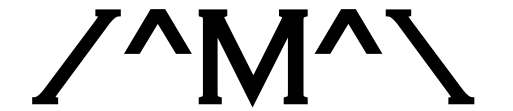

<table style="width:1000px; border: 0px solid black;">
<tr style="border: 0px solid black;">
<td style="border: 0px solid black;">

<h1 style="border-bottom: 0px;font-size:50px;">Count Modula</h1>
<h2 style="border-bottom: 0px;">Plugin modules for VCV Rack v1 by Adam Verspaget (Count Modula)</h2>

</td>
</tr>
</table>

<h3>Licenses</h3>

All source code in this repository is copyright © 2021 Adam Verspaget/Count Modula and licensed under GNU GPLv3

All graphics including the Count Modula logo, panels and components are copyright © 2021 Adam Verspaget/Count Modula and may not be used in derivative works.

<h3>Donate</h3>
Whilst these modules are offered free of charge, if you like them or are using them to make money, please consider a small donation to The Count for the effort.

&nbsp

<h3>Stay Informed</h3>
Follow Count Modula on facebook:

&nbsp

<h3>Modules - Release 2.0.3</h3>

<a href="CHANGELOG.md">Change Log</a>

<a href="MANUAL.md">User Guides</a>

<ul>
<li>4 Bit Sequnce Encoder * New in v2.0.0</li>
<li>Analogue Shift Register</li>
<li>Attenuator</li>
<li>Attenuverter</li>
<li>Basic 8 Step Sequencer</li>
<li>Binary Comparator </li>
<li>Binary Sequencer</li>
<li>Blank Panels</li>
<li>Boolean Logic Modules
<ul>
<li>AND</li>
<li>OR</li>
<li>VC Inverter</li>
<li>XOR</li>
</ul>
</li>
<li>Bar Graph</li>
<li>Bus Route - Switched gate combiner/router </li>
<li>Bus Route 2 - Switched gate combiner </li>
<li>Carousel - Rotating router</li>
<li>Chances -  Bernoulli gate</li>
<li>Clock Divider - a standard clock divider </li>
<li>Clocked Random Gates</li>
<li>Clocked Random Gate Expander - CV</li>
<li>Clocked Random Gates Expander - Logic</li>
<li>Comparator</a></li>
<li>D Flip Flop (Single)</li>
<li>Euclidean Sequencer</li>
<li>Euclidean Sequencer Expander</li>
<li>Event Arranger</a></li>
<li>Event Timer</li>
<li>Fade</li>
<li>Fade Expander</li>
<li>Gate Delay</li>
<li>Gate Modifier</li>
<li>8 x 8 Gate Sequencer</li>
<li>8 x 16 Gate Sequencer</li>
<li>Gate to Trigger</li>
<li>Inverter</li>
<li>Light Strip - LED Blank
<li>Mangler</li>
<li>Manual CV</li>
<li>Manual Gate</li>
<li>Manual Switch 2 - DPDT selecter switch</li>
<li>Manual Switch 3 - 3 input to 1 output selecter switch</li>
<li>Manual Switch 4 - 4 input to 1 output selecter switch</li>
<li>Master Reset Controller</li>
<li>Matrix Combiner - Gate combiner/switched multiple </li>
<li>Matrix Mixer</li>
<li>Minimus Maximus</li>
<li>Mixer</li>
<li>Morph Shaper</li>
<li>Multiple</li>
<li>Multiplexer</li>
<li>Mute</li>
<li>Mute-iple</li>
<li>Octet Trigger Sequencer</li>
<li>Octet Trigger Sequencer CV Expander</li>
<li>Octet Trigger Sequencer Gate Expander </li>
<li>Offset Generator</li>
<li>Oscilloscope</li>
<li>Palette
<li>Polyphonic Breakout</li>
<li>Poly Chances</li>
<li>Poly Gate Modifier</li>
<li>Poly Gate to Trigger</li>
<li>Poly Logic</li>
<li>Polyphonic Manual CV</li>
<li>Polyphonic Min/Max</li>
<li>Polyphonic Mute</li>
<li>Poly VC Polarizer</li>
<li>Poly VC Switch</li>
<li>Polyrhythmic Generator MkII</li>
<li>Rack Ears</li>
<li>Rectifier</li>
<li>Sample & Hold</li>
<li>Sequencer Expanders
<ul>
<li>SX-CV8: CV Expander</li>
<li>SX-OUT8: Output Expander</li>
<li>SX-TRIG8: Gate/Trigger Expander</li>
</ul>
</li>
<li>Shepard Generator</li>
<li>Signal Manifold</li>
<li>SR Flip Flop (Dual)</li>
<li>SR Flip Flop (Single)</li>
<li>Startup Delay</li>
<li>Sub Harmonic Generator</li>
<li>Super Arpeggiator</li>
<li>Super Sample & Hold</li>
<li>Switch 1-8 - 1 To 8 VC Sequential Switch/Router </li>
<li>Switch 1-16 - 1 To 16 VC Sequential Switch/Router </li>
<li>Switch 8-1 - 8 To 1 VC Sequential Switch/Selector </li>
<li>Switch 16-1 - 16 To 1 VC Sequential Switch/Selector </li>
<li>Basic 8 Step Sequencer</li>
<li>8 Step Sequencer</li>
<li>8 Step Sequencer Channel Expander</li>
<li>8 Step Sequencer Gate Expander</li>
<li>8 Step Sequencer Trigger Expander </li>
<li>16 Step Sequencer</li>
<li>16 Step Sequencer Channel Expander</li>
<li>16 Step Sequencer Gate Expander</li>
<li>16 Step Sequencer Trigger Expander </li>
<li>Tapped Gate Delay</li>
<li>T Flip Flop (Dual)</li>
<li>T Flip Flop (Single)</li>
<li>Trigger Sequencer (8 Step)</li>
<li>Trigger Sequencer (16 Step)</li>
<li>Trigger Sequencer Gate Expander</li>
<li>Voltage Controlled Frequency Divider MkII</li>
<li>Voltage Controlled Polarizer</li>
<li>Voltage Controlled Pulse Divider</li>
<li>Voltage Controlled Switch</li>
<li>Voltage Scaler</li>
<li>CGS Based Modules
<ul>
<li>CV Spreader</li>
<li>Burst Generator</li>
<li>Gated Comparator</li>
<li>Gated Comparator Expanders
<ul>
<li>GC-RM: Random Melody Expander</li>
<li>GC-LOGIC: Trigger/Gate Logic Expander</li>
</ul>
</li>
<li>Hyper Maniacal LFO
<ul>
<li>LFO Output Expander</li>
<li>Megaomaniac - CV Expander</li>
</ul>
</li>
<li>Slope Detector</li>
</ul>
</li>
</ul>

